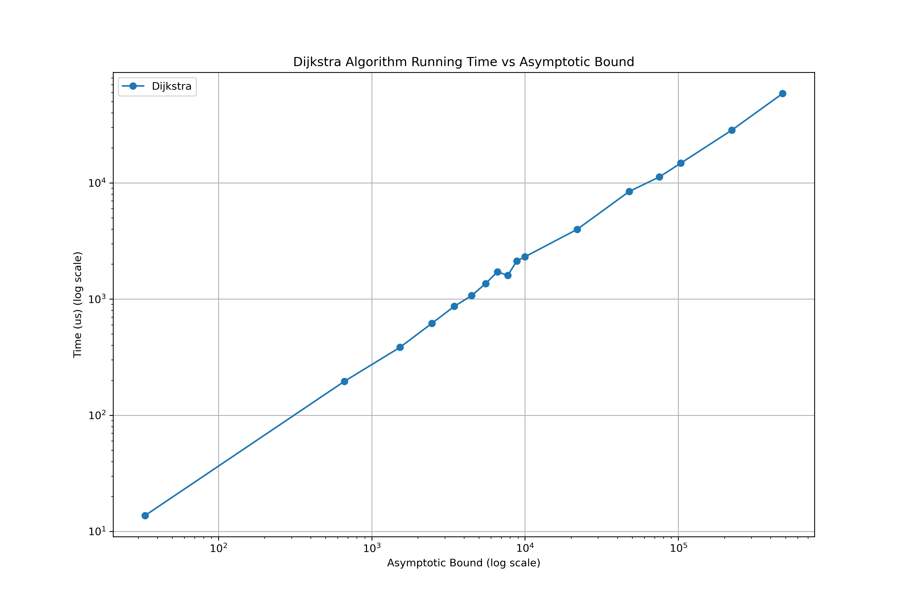
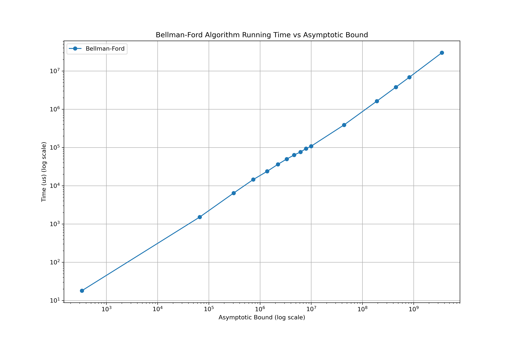
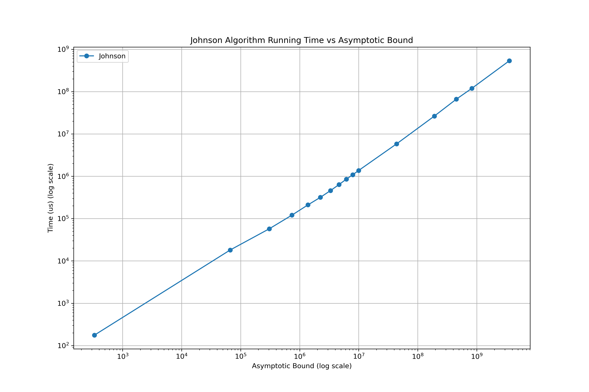
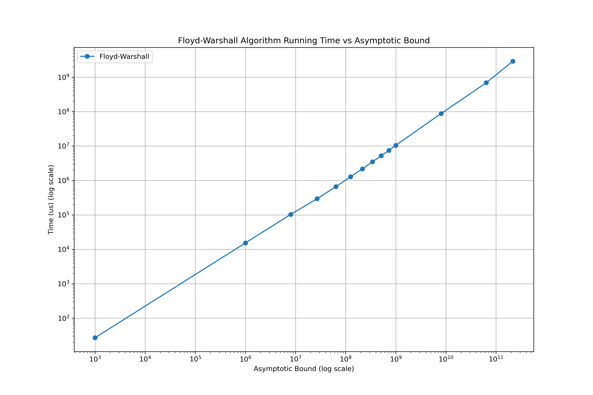
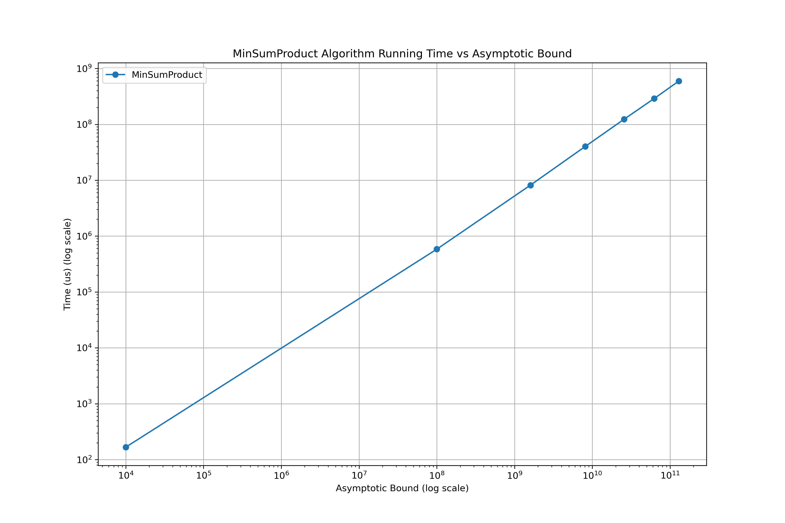

# Algorithm Design Project - Shortest Path in Graphs

This project is about the study of shortest path algorithms in graphs, including both the Single-Source Shortest Path (SSSP) problem and the All-Pairs Shortest Path (APSP) problem. The project implements several classic algorithms and conducts performance testing and comparison.

## Project Content

- **Report**: A detailed introduction to the history, theory, and experimental results of shortest path algorithms.
- **Code**: C++ implementations of the following algorithms:
  - Dijkstra's Algorithm (for single-source shortest path in graphs with non-negative edge weights)
  - Bellman-Ford Algorithm (handles graphs with possible negative edge weights)
  - Johnson's Algorithm (efficiently solves the all-pairs shortest path problem in general weighted graphs)
  - Floyd-Warshall Algorithm (a dynamic programming approach to solve the all-pairs shortest path problem)
  - Min-Sum Product Method (computes shortest paths via matrix products)

## Experimental Results

Performance tests were conducted on randomly generated graphs for each algorithm, including the relationship between running time and the number of nodes, as well as comparisons with theoretical complexity. Detailed results and analysis are provided in the report.

## File Structure

- `generator/`: Contains C++ code for generating random graphs.
- Folders with algorithm name: Contains C++ code for corresponding algorithm.
- `report/`: Contains the LaTeX source files and the generated PDF document of the project report.
- `results/`: Contains the graphs and data generated from the experiments.
- `README.md`: The project description file.
